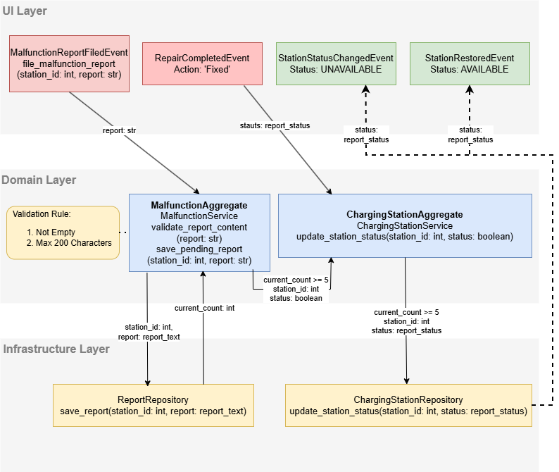

# ChargeHub Berlin

ChargeHub Berlin is an interactive platform designed to streamline the EV charging experience for Berliners. It focuses on two core functions: finding available infrastructure and reporting maintenance needs. Users can search for charging stations by postal code using a real-time filter that displays only currently available plugs, while also actively contributing to the network by reporting malfunctions to improve local charging reliability.


## Problem Statement
Despite the growing number of charging stations in Berlin, electric vehicle (EV) drivers face several critical obstacles:
- **Lack of Real-Time Transparency**: Existing solutions often provide static information.
- **Maintenance Gaps**: Users frequently encounter malfunctioning or unavailable stations.
- **Insufficient Data Integration**: Disconnect between user feedback and infrastructure planning.
- **Geographic Imbalance**: Some districts have insufficient charging capacity or poor data.

## Objectives
- **Streamline the EV Charging Experience**: Make it easy to find and rely on charging stations.
- **Real-Time Availability**: Provide up-to-date information on plug status.
- **Community-Driven Reporting**: Empower users to report issues and improve network reliability.

## Use Cases

### 1. Charging Station Discovery
**Goal**: Allow users to find available charging stations quickly.
- Search by **Postal Code (PLZ)**.
- Filter for **Currently Available Plugs** (Real-time status).
- Visualize search results on a map or list.


### 2. Station Malfunction Management
**Goal**: Enable community-driven maintenance reporting.
- Users report malfunctions for specific stations.
- **Threshold Logic**: When a station receives 5 reports, it is automatically marked as **UNAVAILABLE**.
- Admins can review reports and restore station status.



## Technology Stack

- **Programming Language**: Python 3.10+
- **Frontend**: Streamlit
- **Modeling**: DrawIO, Mermaid, Miro
- **Testing**: pytest (TDD), pytest-cov
- **IDE**: VS Code / PyCharm
- **Communication**: Synchronous Event Bus (Prototype)

## Project Development Documentation

### 1. Domain Modeling and Event Structure

The project follows a **Domain-Driven Design (DDD)** approach with strict separation of concerns into **Bounded Contexts**.

**Project Structure**:
```
src/chargehub/
├── discovery/                 # [Bounded Context] Charging Station Discovery
│   ├── application/           # Application Services, DTOs
│   ├── domain/                # Domain Entities, Value Objects, Events, Repository Interfaces
│   ├── infrastructure/        # Repositories implementation (CSV/In-Memory)
│   └── presentation/          # UI Components (Streamlit Views)
└── malfunction/               # [Bounded Context] Station Malfunction Management
    ├── application/
    ├── domain/
    ├── infrastructure/
    └── presentation/
```

- **Domain Event Flows**: Communication between contexts happens via Domain Events (e.g., `StationStatusChangedEvent`).
- **Bounded Contexts**:
    - **Discovery**: Optimized for reading and searching high volumes of data.
    - **Malfunction**: Handles business logic for reporting and status updates.

### 2. Test-Driven Development (TDD)

The team followed a **TDD approach** (Red-Green-Refactor):
1.  **Red**: Write a failing test for a specific requirement (e.g., "Station should be marked unavailable after 5 reports").
2.  **Green**: Implement the minimal logic to make the test pass.
3.  **Refactor**: Improve code structure while keeping tests green.

**Test Coverage**:
We adhered to the principle of maintaining high test coverage.
- **Target**: >80% coverage.
- **Actual**: **99%** coverage of the source code.

To verify coverage locally:
```bash
pytest --cov=src
```

### 3. Backend Architecture
- **Core Components**: Segregated into `domain` (business logic), `application` (use case orchestration), and `infrastructure` (data access).
- **Data Model**:
    - **Discovery**: Uses read-optimized models. Data is initially loaded from CSV files (`data/charging_stations.csv`) using a Repository pattern.
    - **Malfunction**: Uses an In-Memory repository for this prototype to store reports and dynamic status changes.

### 4. UI Components
- Built with **Streamlit** for rapid prototyping and interactivity.
- **User Interaction Flow**:
    1.  User enters a PLZ.
    2.  System filters and displays stations.
    3.  User can report a malfunction for a specific station.
    4.  UI updates to reflect new status interactions.

## Integration of Explored Datasets

- **Approach**: We utilized the provided Berlin Charging Station dataset (CSV).
- **Isolating Access**: Instead of coupling the domain logic to CSV parsing, we implemented **Repositories** (`ChargingStationCSVRepository`) that act as an **Anti-Corruption Layer (ACL)**. They read the raw CSV rows and map them to clean Domain Entities (`ChargingStation`).
- **Formatting Issues**:
    - Address parsing and coordinate extraction were handled within the Infrastructure layer to ensure the Domain layer remains clean.
    - Value Objects (e.g., `PostalCode`) validate data integrity upon object creation.
- **DDD Adherence**: The external data structure does not dictate our internal model. We transform "rows" into "Aggregates".

## Quickstart

### Install
```bash
pip install -r requirements.txt
```

### Run Tests
```bash
pytest
```

### Run Application
```bash
streamlit run main.py
```