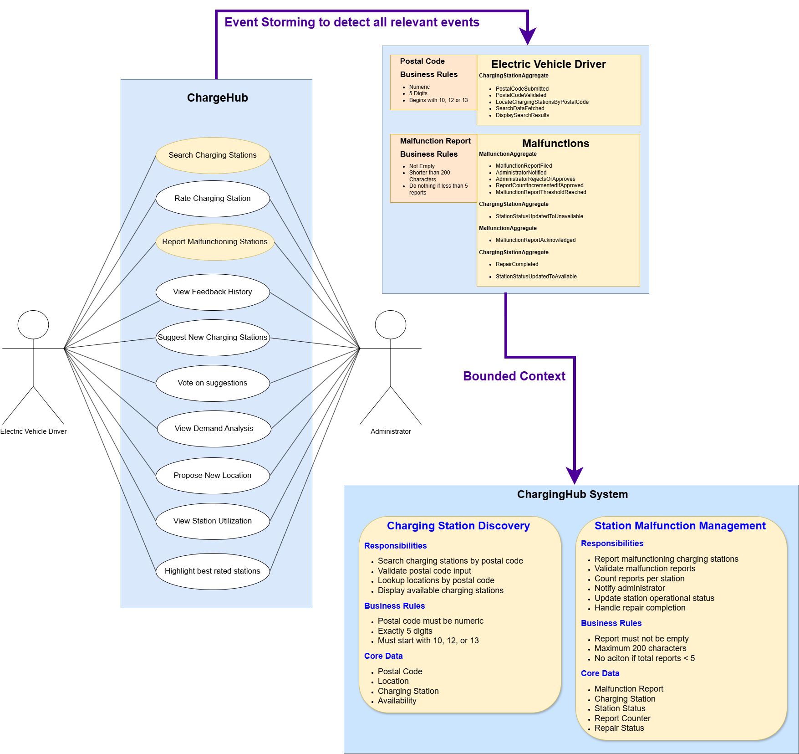
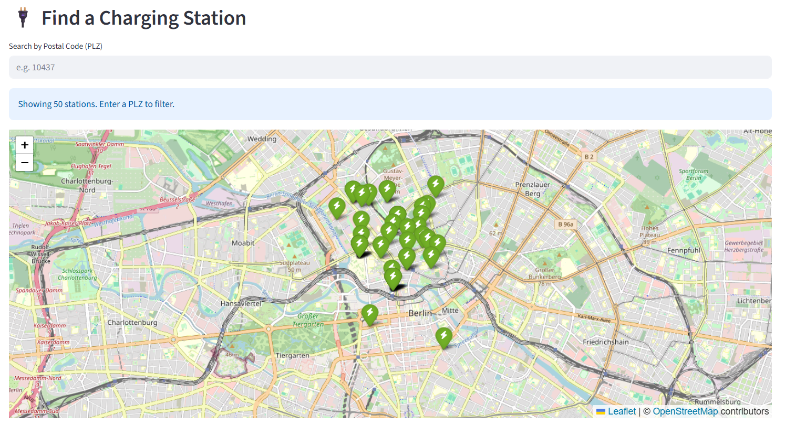
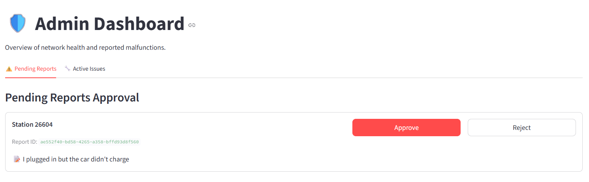

# ChargeHub Berlin – Project Documentation

## Team Information

**Team:** Team 2  
**Git Repository:** https://github.com/RamezCh/ChargeHub_Berlin  

**Team Members:**
- 110308 Ramez Chreide  
- 824145 Volkan Korunan  
- 111935 Jawad Ahmed  
- 110478 Ali Ahmadi  

---

## 1. Introduction to the Topic and Selected Use Cases

### 1.1 Project Overview

ChargeHub Berlin is an interactive platform designed to improve the electric vehicle charging experience for residents of Berlin.  
The platform focuses on two core challenges in urban electromobility:

- Discovering available EV charging infrastructure  
- Reporting and managing malfunctioning charging stations  

Users can search for charging stations by postal code and view only currently available charging plugs. In addition, users can report malfunctions, enabling community driven feedback that improves infrastructure reliability and transparency.

---

### 1.2 Use Case Diagram

The following diagram illustrates the two core use cases of the system and their bounded contexts. It is the result of domain analysis and event storming.



---

### 1.3 Problem Statement

Despite the growing number of EV charging stations in Berlin, several challenges hinder seamless adoption:

- **Lack of real-time transparency**  
  Existing platforms often rely on static data that does not reflect actual availability.

- **Maintenance gaps**  
  Malfunctioning stations are frequently underreported or not updated promptly.

- **Missing feedback integration**  
  Community feedback is not systematically incorporated into operational workflows.

- **Geographic imbalance**  
  Certain districts lack reliable or sufficient charging infrastructure data.

---

### 1.4 Objectives

The main objectives of the project are:

- Provide transparent access to charging station data by postal code  
- Enable structured reporting and tracking of station malfunctions  
- Reuse datasets explored in Part 1 of the module  
- Apply Domain Driven Design, Test Driven Development, UML, and SOLID principles  
- Demonstrate the transformation of data driven insights into production ready software  

---

### 1.5 Selected Use Cases

#### Use Case 1: Charging Station Discovery by Postal Code

Users search for charging stations within a given postal code.

**Business Rules:**
- Postal code must be numeric  
- Exactly five digits  
- Must start with `10`, `12`, or `13`  

The system retrieves all matching charging stations and displays their availability and utilization status.

---

#### Use Case 2: Malfunction Reporting for Charging Stations

Users report malfunctioning charging stations.

**Workflow:**
- Validation of the report  
- Storage and administrator review  
- Threshold based status change to unavailable  
- Status restoration after repair completion  

Both use cases were modeled using UML use case diagrams, workflow diagrams, sequence diagrams, and domain event flow diagrams.

---

## 2. Technology Stack

- **Programming Language:** Python 3  
- **Architecture:** Domain Driven Design and Clean Architecture  
- **Frontend:** Streamlit  
- **Testing Framework:** PyTest  
- **Persistence:** In memory data structures and CSV datasets  
- **Modeling Tools:** UML, Miro, Mermaid, Draw.io  
- **IDE:** VS Code, PyCharm  
- **Version Control:** Git and GitHub  
- **LLM Support:** ChatGPT, Gemini, Claude  

Streamlit was selected to rapidly prototype user workflows while maintaining strict separation between presentation, application, and domain layers.

---

## 3. Project Development Documentation

### 3.1 Domain Modeling and Event Structure

The system was designed using Domain Driven Design. Event storming was applied to identify commands, aggregates, domain events, and business rules.

#### Bounded Contexts

- **Charging Station Discovery Context**  
  Responsible for searching and locating charging stations by postal code and availability.

- **Malfunction Management Context**  
  Responsible for reporting, reviewing, and resolving charging station malfunctions.

---

#### Aggregates

- **ChargingStationAggregate**
  - Postal code validation  
  - Station lookup  
  - Availability checks  
  - Status updates  

- **MalfunctionAggregate**
  - Report validation  
  - Report counting  
  - Administrator approval  
  - Threshold handling  

---

#### Key Domain Events

**Charging station discovery**
- PostalCodeSubmitted  
- PostalCodeValidated  
- LocateChargingStationsByPostalCode  
- SearchDataFetched  
- DisplaySearchResults  

**Malfunction reporting**
- MalfunctionReportFiled  
- AdministratorNotified  
- AdministratorRejectsOrApproves  
- ReportCountIncrementedIfApproved  
- MalfunctionReportThresholdReached  
- StationStatusUpdatedToUnavailable  
- RepairCompleted  
- StationStatusUpdatedToAvailable  

---

### 3.1.1 Project Scaffold and Layered Structure

The project follows Clean Architecture with strict dependency rules.

**Placeholder: Project folder structure screenshot**  
*(Insert IDE screenshot showing domain, application, infrastructure, and presentation layers)*

Layer responsibilities:
1. **Domain:** Aggregates, value objects, domain events, repository interfaces  
2. **Application:** Services orchestrating domain logic  
3. **Infrastructure:** CSV and in memory repository implementations  
4. **Presentation:** Streamlit UI components  

---

### 3.1.2 Domain Visualizations

#### Use Case: Charging Station Discovery

**Domain Event Flow**  


**Sequence Diagram**  


---

#### Use Case: Malfunction Reporting

**Domain Event Flow**  


**Sequence Diagram**  


---

### 3.2 Test Driven Development (TDD)

Test Driven Development was applied throughout the project using a Red Green Refactor cycle.

#### Development Approach

Each team member was responsible for a specific use case or domain area. Development started by writing unit tests for business rules before implementing production code. Coordination was handled through Git branches and regular code reviews.

---

#### TDD Adherence

Strict TDD was applied for all core domain logic. Minor UI related components were implemented iteratively due to Streamlit constraints.

---

#### Test Coverage

Test coverage exceeds the required 80 percent threshold. Critical components such as validation logic, threshold handling, and state transitions are fully covered.

Coverage was monitored using PyTest and IDE tooling.

---

#### Explicit TDD Example: Malfunction Threshold Logic

**RED – Failing Test**
```python
def test_threshold_marks_station_unavailable():
    events = service.approve_report(report_id)
    station = charging_repo.get_all()[0]
    assert station.available is False
```

**GREEN – Minimal Implementation**
```python
def approve_report(self, report_id):
    count = self.report_repository.count_reports(station_id)
    if count >= 5:
        self.charging_station_repository.update_station_status(station_id, False)
```

**REFACTOR – Domain Driven Solution**
```python
if current_count >= self.threshold:
    events.append(MalfunctionReportThresholdReachedEvent(
        station_id=station_id,
        threshold=self.threshold,
        current_count=current_count
    ))
    self.charging_station_repository.update_station_status(
        station_id=station_id,
        status=False
    )
    events.append(StationStatusChangedEvent(
        station_id=station_id,
        status="UNAVAILABLE"
    ))
```

---

#### Backend Architecture and SOLID Principles

Domain logic depends only on abstractions. Repository interfaces are defined in the domain layer and implemented in the infrastructure layer.

**Domain Interface Example**
```python
class ChargingStationRepository(ABC):
    @abstractmethod
    def locate_charging_stations(self, postal_code):
        pass

    @abstractmethod
    def update_station_status(self, station_id, status):
        pass
```

**Infrastructure Implementation Example**
```python
class ChargingStationCSVRepository(ChargingStationRepository):
    def locate_charging_stations(self, postal_code):
        return [s for s in self._stations if s.postal_code == postal_code.value]
```

---

#### UI Components

The Streamlit interface supports:
- Charging station search by postal code  


- Malfunction reporting workflow  


---

### 3.3 Integration of Explored Datasets

CSV based charging station datasets from Part 1 were integrated into the discovery context.

- Repository interfaces abstract data access  
- Existing logic was retested after integration  
- Formatting issues were resolved during parsing  
- Infrastructure concerns remain isolated from domain logic  

---

### 3.4 LLM Integration

LLMs were used selectively for:
- Domain Driven Design modeling guidance  
- Diagram generation support  
- Code structure and refactoring suggestions  

All architectural and engineering decisions remained human driven.

---

## 4. Technical Challenges

### Challenge 1: Maintaining Strict TDD Discipline  
**Solution:** Clear task separation and regular code reviews ensured compliance.

### Challenge 2: Structuring the Domain Model  
**Solution:** Iterative refinement of bounded contexts and domain event flows.

---

## 5. Project Completion and Reflection

### 5.1 Milestones Achieved
- Two core use cases fully implemented  
- Domain driven architecture established  
- Test coverage exceeding the required threshold  

---

### 5.2 Not Achieved
- Advanced demand visualization  
- Gamification features  
- Login system and email notifications  

---

### 5.3 Lessons Learned
- TDD improves maintainability and confidence  
- DDD reduces complexity in evolving systems  
- LLMs add value when used selectively  

---

## 6. Conclusion

ChargeHub Berlin demonstrates the application of modern software engineering practices to a real world urban mobility problem. The project establishes a solid foundation for future extensions and potential real world deployment.